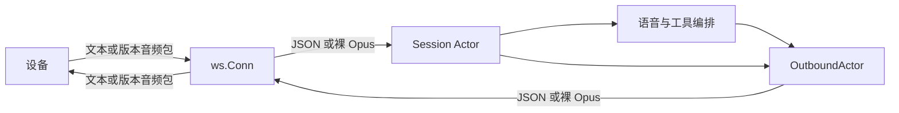

# WebSocket 协议接入

主要读者：实现、审查和验证人员。状态：v1、v2、v3 已实现，本地协议与模拟语音链路回归通过；尚未进行本轮真机和真实 AI 服务联调。

## 模块职责

| 位置 | 职责与约束 |
| --- | --- |
| [`internal/protocol/ws`](../../internal/protocol/ws/) | 版本解析、固定版本连接、二进制音频封包与解包、上行消息大小限制；不依赖 Session、语音引擎或数据库 |
| [`session.Handler`](../../internal/session/handler.go) | HTTP 请求校验、鉴权、准入、运行时装配；为每条连接确定一次协议版本 |
| [`session.Session`](../../internal/session/session.go) | hello 校验、状态机、轮次调度、关闭和资源回收；接收裸 Opus，不解析版本包头 |
| [`session.OutboundActor`](../../internal/session/outbound.go) | 独占业务消息写入，管理现有批次、有界队列、写超时和轮次失效 |
| [`internal/voice`](../../internal/voice/) | ASR、LLM、TTS 编排及音频处理，不感知 WebSocket 协议版本 |
| [`internal/router`](../../internal/router/ota_handler.go) | OTA 下发地址、凭证和配置版本，不决定已建立连接的版本 |

`protocol` 只作为目录分类，实际 Go 包为 `ws`。`ws.Conn` 是持有私有底层连接的具体类型，不新增 goroutine、队列或状态机。Session 的读循环负责上行；所有业务下行经 OutboundActor 调用 `ws.Conn.Write`。关闭控制帧由会话生命周期管理。



## 建连与文本消息

1. 三个版本共用 `/xiaozhi/v1/`，URL 中的 `v1` 不用于版本协商。
2. HTTP 升级请求必须包含且只包含一个 `Protocol-Version` 值，去除首尾空白后只能是 `1`、`2` 或 `3`。缺失、重复、逗号列表、`01`、`+1` 和不支持的值在升级前返回 HTTP 400。
3. 设备继续使用 `Authorization: Bearer <token>`。版本合法并不绕过鉴权、Agent 配置检查或并发准入。
4. 首个应用消息必须是文本 hello；`hello.version` 必须与请求头一致。连接建立后版本不再切换；重复 hello 会关闭连接。
5. 上行 hello 音频参数仍要求 Opus、16 kHz、单声道、60 ms；服务端 hello 宣告下行 Opus、24 kHz、单声道、60 ms。

JSON 消息不添加二进制协议头。三个版本共享 hello、listen、abort、STT、TTS 和 MCP 文本语义。声明 `features.mcp` 后按既有 MCP 流程发现工具。`auto` 和 `manual` 保持原有轮次行为，`realtime` 被拒绝。

hello 定时器仅在等待握手阶段生效；收音定时器必须属于当前轮次且该轮仍在收音，迟到事件会被忽略。协议或业务异常通过 `closeWithReason` 关闭时，先取消当前语音任务，再发送关闭帧，最后取消会话读上下文。外部主动停机或设备互斥淘汰仍沿用取消上下文的方式，不保证设备收到指定关闭码。

## 二进制音频

这里的 v1、v2、v3 指小智应用消息格式。一个 WebSocket 二进制消息承载一个 Opus 包，多字节头字段使用大端序。

| 版本 | 包头 | 字段布局 |
| --- | --- | --- |
| v1 | 0 字节 | 直接发送 Opus payload |
| v2 | 16 字节 | `version:u16`、`type:u16`、`reserved:u32`、`timestamp:u32`、`payload_size:u32`、payload |
| v3 | 4 字节 | `type:u8`、`reserved:u8`、`payload_size:u16`、payload |

- 仅支持音频类型 `type=0`，v2 包头还要求 `version=2`。
- payload 必须非空，声明的大小必须与实际剩余字节数完全相等；短包、截断和尾随字节均拒绝。
- 上行 `reserved` 与 v2 `timestamp` 被忽略，下行相应字段填零。
- v3 的长度字段最多表示 65535 字节，不允许整数截断。该值是封包格式上限，实际音频还受应用配置和 Opus 解码约束。
- v2、v3 封包分配独立输出，不修改音频调用方提供的 payload。

版本封包支持不代表 AEC 能力。当前不会利用时间戳做回声对齐，也不向设备声明服务端 AEC 支持；有此需求的设备配置需另行验证。

## 大小限制与错误

[`ws.Conn`](../../internal/protocol/ws/conn.go) 先通过 WebSocket 库的消息限额控制读取，再按消息类型检查：

```text
library_read_limit = max(max_ws_text_message_bytes, max_opus_packet_bytes + header_size)
```

连接层的 `session.max_opus_packet_bytes` 限额只计算上行裸 Opus，版本包头不占用此预算；`session.max_ws_text_message_bytes` 约束完整上行文本，包括 hello。`ws.Conn` 不用这两项限制下行。语音引擎仍沿用 `max_opus_packet_bytes` 作为 TTS 和轮次提示音的 Opus 编码输出预算；预编码就绪提示音使用独立预算，因此不会因为较小的上行限额而被连接层拒绝。

| 关闭码 | 场景 |
| --- | --- |
| 1008 | 非法音频封包、hello 失败或超时、重复 hello、收音超时、非法核心文本消息、上行或待处理轮次缓冲溢出 |
| 1009 | 上行文本或 Opus 超出限额，包括 WebSocket 库首先发现的过大消息 |
| 1011 | 内部读写、会话 Id 生成或语音轮次执行失败 |

ws 包返回协议错误；Session 决定关闭策略。库已发送关闭帧时遵循库的关闭结果。错误日志与关闭原因分开处理，关闭原因使用受控短文本。

## OTA 配置

按照[配置示例](../../config.example.yaml)，在 `config.yaml` 的 server 段中设置：

```yaml
server:
  websocket_url: "ws://192.168.1.100:8080/xiaozhi/v1/"
  websocket_version: 1
```

省略 `websocket_version` 时默认 `1`；YAML 空值同样保留此默认值。合法值为 `1`、`2`、`3`，零、负数、其他版本和小数在加载配置时失败。

有 SN 和无 SN 的 OTA 发现流程都会以 JSON 数字下发 `websocket.version`。该全局配置只影响 OTA 建议设备使用的版本；服务端始终接受所有受支持版本，已有连接继续使用自身的版本。修改配置文件后需要按现有方式重新加载服务配置，当前没有为此新增热更新机制。

## 验收基线

| 验证入口 | 覆盖内容 |
| --- | --- |
| [`ws` 测试](../../internal/protocol/ws/) | 独立字节向量、双向封包、头字段及大小校验、v3 边界、读取限额和保留数据 |
| [`protocol_test.go`](../../internal/session/protocol_test.go) | 三版本真实本地 WebSocket，auto/manual 音频编解码、ASR/LLM/TTS 模拟轮次、提示音、MCP 发现、异常音频、混合连接与版本冲突 |
| [`websocket_test.go`](../../internal/session/websocket_test.go) | 握手失败、收音超时、迟到定时器、关闭帧、任务取消及背压关闭 |
| [`websocket_version_test.go`](../../internal/config/websocket_version_test.go) | 默认版本、合法配置和非法值 |
| [`ota_version_test.go`](../../internal/router/ota_version_test.go) | 三版本 OTA 下发和两种设备身份流程 |

本地执行命令：

```bash
go test ./...
go test -race ./internal/protocol/ws ./internal/config ./internal/session ./internal/router
go test ./internal/protocol/ws -run '^$' -fuzz '^FuzzDecodeAudio$' -fuzztime=30s -parallel=4
```

编译测试需要 Go 和项目既有的 libopus、opusfile 依赖。测试使用本地 httptest、模拟 AI 客户端和隔离的 SQLite 内存数据库，不依赖真实设备、业务数据库或云端 AI 凭证。

本轮音频模糊测试累计执行 2,144,389 次输入并通过。真机录放音、弱网体验、服务端 AEC 和真实 AI 服务联调不在这些本地测试的证明范围内。
